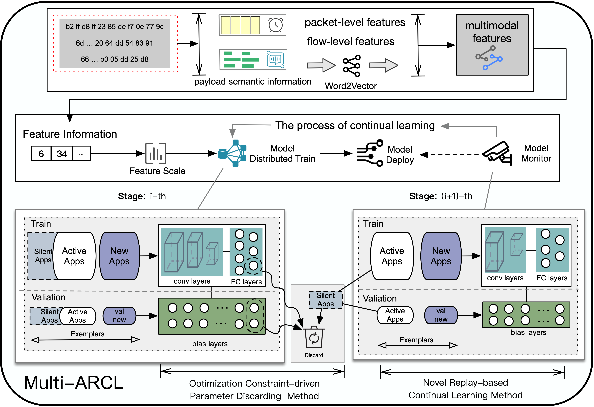

# 🦜 Multi-ARCL: Multimodal Adaptive Relay-based Distributed Continual Learning for Encrypted Traffic Classification 

<p align="center">
  <a href="#-introduction">🎉Introduction</a> •
  <a href="#-model">🦜Model</a> •
  <a href="#-train">🔥Train</a> •
  <a href="#-datasets">🌟Datasets</a> •
  <a href="#-mmmb">🎄MMMB</a> <br />
  <a href="#-quick-start">📍Quick Start</a> •
  <a href="#-acknowledgement">👨‍🏫Acknowledgement</a> •  
  <a href="#-contact">🤗Contact</a>
</p>

## 🎉 Introduction

## 🦜 Model
<div align="center">
  
</div>

## 🔥 Train

if you use parallel computing, please use this code：
two gpus
```
CUDA_VISIBLE_DEVICES=0,1 python -m torch.distributed.launch --nproc_per_node=2 secondmain.py
```
four gpus
```
CUDA_VISIBLE_DEVICES=0,1,2,3 python -m torch.distributed.launch --nproc_per_node=4 secondmain.py
```
if you find the error: 
```
File "/home/vipuser/miniconda3/lib/python3.8/site-packages/torch/distributed/rendezvous.py", line 179, in _env_rendezvous_handler
    store = TCPStore(master_addr, master_port, world_size, start_daemon, timeout)
RuntimeError: Address already in use
...
```
use this command:
```
kill $(lsof -t -i:12359)
```
and then reuse parallel computing.
